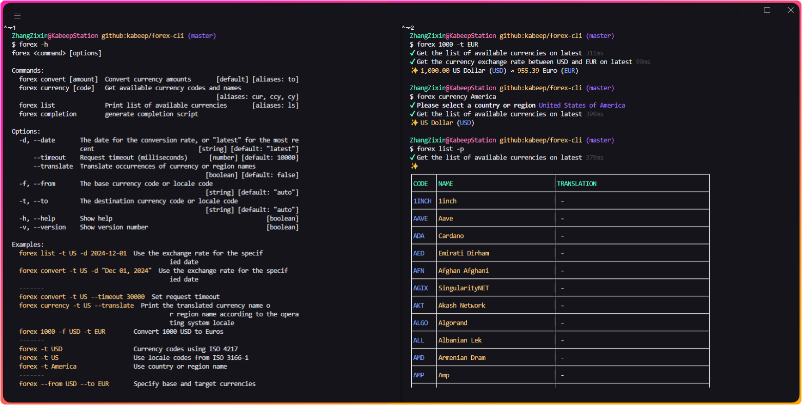

<div align="center">

<h1>forex-cli</h1>

[![NodeJS][node-image]][node-url]
[![Install Size][install-size-image]][install-size-url]
[![NPM][npm-image]][npm-url]
[![code style][code-style-image]][code-style-url]
[![License][license-image]][license-url]

English | [简体中文][zh-cn-url]

![Insights][insights-image]



</div>

## 📖 Introduction

A Node.js Library to convert foreign exchange in terminal.

## ⚙️ Installation

```bash
npm install --global @kabeep/forex-cli
```

```bash
yarn add --global @kabeep/forex-cli
```

```bash
pnpm add --global @kabeep/forex-cli
```

## 🚀 Usage

```bash
forex -h
```

```bash
forex <command> [options]

Commands:
  forex convert [amount]  Convert currency amounts       [default] [aliases: to]
  forex currency [code]   Get available currency codes and names
                                                         [aliases: cur, ccy, cy]
  forex list              Print list of available currencies       [aliases: ls]
  forex completion        generate completion script

Options:
  -d, --date       The date for the conversion rate, or "latest" for the most re
                   cent                             [string] [default: "latest"]
      --timeout    Request timeout (milliseconds)      [number] [default: 10000]
      --translate  Translate occurrences of currency or region names
                                                      [boolean] [default: false]
  -f, --from       The base currency code or locale code
                                                      [string] [default: "auto"]
  -t, --to         The destination currency code or locale code
                                                      [string] [default: "auto"]
  -h, --help       Show help                                           [boolean]
  -v, --version    Show version number                                 [boolean]

Examples:
  forex list -t US -d 2024-12-01  Use the exchange rate for the specif
                                            ied date
  forex convert -t US -d "Dec 01, 2024"  Use the exchange rate for the specif
                                            ied date
  -------
  forex convert -t US --timeout 30000  Set request timeout
  forex currency -t US --translate  Print the translated currency name o
                                            r region name according to the opera
                                            ting system locale
  forex 1000 -f USD -t EUR        Convert 1000 USD to Euros
  -------
  forex -t USD                    Currency codes using ISO 4217
  forex -t US                     Use locale codes from ISO 3166-1
  forex -t America                Use country or region name
  -------
  forex --from USD --to EUR       Specify base and target currencies
  forex --from USD                Specify one of the currencies and au
                                            tomatically fill in the other curren
                                            cy through the OS's locale
  forex --to USD                  Specify one of the currencies and au
                                            tomatically fill in the other curren
                                            cy through the OS's locale
```

### Quick Start

Convert 1000 Euros to your currency (obtained based on OS's locale).

```bash
forex 1000 --from EUR
```

```
✔ Get the list of available currencies on latest 381ms
✔ Get the currency exchange rate between EUR and USD on latest 120ms
✨ 1,000.00 Euro (EUR) ≈ 1,050.60 US Dollar (USD)
```

## 🔩 Command

| Command      | Aliases              | Default | Parameter                                                      | Description                            |
|--------------|----------------------|---------|----------------------------------------------------------------|----------------------------------------|
| `convert`    | `to`                 | true    | amount                                                         | Convert currency amounts               |
| `currency`   | `cur` / `ccy` / `cy` | false   | currency code / country or region code /country or region name | Get available currency codes and names |
| `list`       | `ls`                 | false   | -                                                              | Print list of available currencies     |
| `completion` | -                    | false   | -                                                              | Generate completion script             |
| `help`       | -                    | false   | -                                                              | Show help                              |

**Common Options:**

```bash
forex list --date "Dec 01, 2024" --timeout 10000 --translate
```

| Option             | Type      | Optional | Default    | Description                                                       |
|--------------------|-----------|----------|------------|-------------------------------------------------------------------|
| `--date` / `-d`    | `string`  | true     | `"latest"` | The date for the conversion rate, or "latest" for the most recent |
| `--timeout`        | `number`  | true     | `10_000`   | Request timeout (milliseconds)                                    |
| `--translate`      | `boolean` | true     | `false`    | Translate occurrences of currency or region names                 |
| `--version` / `-v` | `boolean` | true     | `false`    | Show version number                                               |
| `--help` / `-h`    | `boolean` | true     | `false`    | Show help                                                         |

### $ CONVERT (Default)

Convert currency amounts.

Supports numeric separators `10_000`, grouped numbers `10,000` and scientific notation `1.23e3`.

```bash
forex convert -h
```

```
forex convert [amount]

Convert currency amounts

Options:
  -d, --date       The date for the conversion rate, or "latest" for the most re
                   cent                             [string] [default: "latest"]
      --timeout    Request timeout (milliseconds)      [number] [default: 10000]
      --translate  Translate occurrences of currency or region names
                                                      [boolean] [default: false]
  -f, --from       The base currency code or locale code
                                                      [string] [default: "auto"]
  -t, --to         The destination currency code or locale code
                                                      [string] [default: "auto"]
  -h, --help       Show help                                           [boolean]
  -v, --version    Show version number                                 [boolean]

Examples:
  forex 1000 -f USD -t EUR   Convert 1000 USD to Euros
  -------
  forex -t USD               Currency codes using ISO 4217
  forex -t US                Use locale codes from ISO 3166-1
  forex -t America           Use country or region name
  -------
  forex --from USD --to EUR  Specify base and target currencies
  forex --from USD           Specify one of the currencies and automat
                                       ically fill in the other currency through
                                        the OS's locale
  forex --to USD             Specify one of the currencies and automat
                                       ically fill in the other currency through
                                        the OS's locale
```

- Convert 1000 USD to Euros.

  ```bash
  forex convert 1000 --from USD --to EUR
  ```

  ```
  ✔ Get the list of available currencies on latest 369ms
  ✔ Get the currency exchange rate between USD and EUR on latest 119ms
  ✨ 1,000.00 US Dollar (USD) ≈ 951.83 Euro (EUR)
  ```

- Convert your 1000 quantity currency to Euros (acquired based on OS's locale).

  ```bash
  forex convert 1000 --to EUR
  ```

  ```
  ✔ Get the list of available currencies on latest 369ms
  ✔ Get the currency exchange rate between USD and EUR on latest 119ms
  ✨ 1,000.00 US Dollar (USD) ≈ 951.83 Euro (EUR)
  ```

- Convert 1000 Euros to your currency (obtained based on OS's locale).

  ```bash
  forex convert 1000 --from EUR
  ```

  ```
  ✔ Get the list of available currencies on latest 369ms
  ✔ Get the currency exchange rate between EUR and USD on latest 119ms
  ✨ 1,000.00 Euro (EUR) ≈ 1,050.60 US Dollar (USD)
  ```

| Option          | Type     | Optional | Default  | Description                                  |
|-----------------|----------|----------|----------|----------------------------------------------|
| `--from` / `-f` | `string` | true     | `"auto"` | The base currency code or locale code        |
| `--to` / `-t`   | `string` | true     | `"auto"` | The destination currency code or locale code |

---

### $ CURRENCY

Get available currency codes and names.

```
forex currency [code]

Get available currency codes and names

Options:
  -d, --date       The date for the conversion rate, or "latest" for the most re
                   cent                             [string] [default: "latest"]
      --timeout    Request timeout (milliseconds)      [number] [default: 10000]
      --translate  Translate occurrences of currency or region names
                                                      [boolean] [default: false]
  -v, --version    Show version number                                 [boolean]
  -h, --help       Show help                                           [boolean]

Examples:
  forex cy US       Obtained via ISO-3166-1-alpha-2 region code
  forex cy USD      Obtained via ISO 4217 currency code
  forex cy America  Get by country or region name
```

- Obtained via `ISO-3166-1-alpha-2` region code.

  ```bash
  forex currency US
  ```

  ```
  ✔ Get the list of available currencies on latest 369ms
  ✨ US Dollar (USD)
  ```

- Obtained via `ISO 4217` currency code.

  ```bash
  forex currency USD
  ```

  ```
  ✔ Get the list of available currencies on latest 369ms
  ✨ US Dollar (USD)
  ```

- Get by country or region name.

  ```bash
  forex currency America
  ```

  ```
  ✔ Get the list of available currencies on latest 369ms
  ✨ US Dollar (USD)
  ```

---

### $ LIST

Print list of available currencies.

```bash
forex list -h
```

```
forex list

Print list of available currencies

Options:
  -d, --date       The date for the conversion rate, or "latest" for the most re
                   cent                             [string] [default: "latest"]
      --timeout    Request timeout (milliseconds)      [number] [default: 10000]
      --translate  Translate occurrences of currency or region names
                                                      [boolean] [default: false]
  -p, --pretty     Pretty output format               [boolean] [default: false]
  -v, --version    Show version number                                 [boolean]
  -h, --help       Show help                                           [boolean]

Examples:
  forex ls     Shows the latest list of available currencies
  forex ls -p  Use unicode table to prettier printed content
```

| Option            | Type      | Optional | Default | Description          |
|-------------------|-----------|----------|---------|----------------------|
| `--pretty` / `-p` | `boolean` | true     | `false` | Pretty output format |

- Shows the latest list of available currencies.

  ```bash
  forex list
  ```

  ```
  Bitcoin (BTC)
  Chinese Yuan Renminbi (CNY)
  Ethereum (ETH)
  Euro (EUR)
  Japanese Yen (JPY)
  Hong Kong Dollar (HKD)
  Singapore Dollar (SGD)
  US Dollar (USD)
  Tether (USDT)
  Gold Ounce (XAU)
  ...
  ```

- Use unicode table to prettier printed content.

  ```bash
  forex list --pretty
  ```

  ```
  ┌──────┬────────────────────────────────┬──────────────────────────────────────────┐
  │CODE  │NAME                            │TRANSLATION                               │
  ├──────┼────────────────────────────────┼──────────────────────────────────────────┤
  │BTC   │Bitcoin                         │ -                                        │
  ├──────┼────────────────────────────────┼──────────────────────────────────────────┤
  │CNY   │Chinese Yuan Renminbi           │ -                                        │
  ├──────┼────────────────────────────────┼──────────────────────────────────────────┤
  │ETH   │Ethereum                        │ -                                        │
  ├──────┼────────────────────────────────┼──────────────────────────────────────────┤
  │EUR   │Euro                            │ -                                        │
  ├──────┼────────────────────────────────┼──────────────────────────────────────────┤
  │JPY   │Japanese Yen                    │ -                                        │
  ├──────┼────────────────────────────────┼──────────────────────────────────────────┤
  │HKD   │Hong Kong Dollar                │ -                                        │
  ├──────┼────────────────────────────────┼──────────────────────────────────────────┤
  │SGD   │Singapore Dollar                │ -                                        │
  ├──────┼────────────────────────────────┼──────────────────────────────────────────┤
  │USD   │US Dollar                       │ -                                        │
  ├──────┼────────────────────────────────┼──────────────────────────────────────────┤
  │USDT  │Tether                          │ -                                        │
  ├──────┼────────────────────────────────┼──────────────────────────────────────────┤
  │XAU   │Gold Ounce                      │ -                                        │
  ├──────┼────────────────────────────────┼──────────────────────────────────────────┤
  │...   │...                             │...                                       │
  └──────┴────────────────────────────────┴──────────────────────────────────────────┘
  ```


---

### $ COMPLETION

Generate completion script.

```bash
forex completion -h
```

```
###-begin-forex-completions-###
#
# yargs command completion script
#
# Installation: forex completion >> ~/.bashrc
#    or forex completion >> ~/.bash_profile on OSX.
#
_forex_yargs_completions()
{
    local cur_word args type_list

    cur_word="${COMP_WORDS[COMP_CWORD]}"
    args=("${COMP_WORDS[@]}")

    # ask yargs to generate completions.
    type_list=$(forex --get-yargs-completions "${args[@]}")

    COMPREPLY=( $(compgen -W "${type_list}" -- ${cur_word}) )

    # if no match was found, fall back to filename completion
    if [ ${#COMPREPLY[@]} -eq 0 ]; then
      COMPREPLY=()
    fi

    return 0
}
complete -o bashdefault -o default -F _forex_yargs_completions forex
###-end-forex-completions-###
```

---

### $ HELP

Show help.

```bash
forex help
```

- Show `convert` help.

  ```bash
  forex convert help
  ```

- Show `currency` help.

  ```bash
  forex currency help
  ```

- Show `list` help.

  ```bash
  forex list help
  ```

## 🌐 i18n

| Language Name      | Native Name | ISO-639-1 | ISO-3166-1 (Alpha-2) | Locale File                  |
|:-------------------|:-----------:|:---------:|:--------------------:|:-----------------------------|
| English            |      -      |    en     |          US          | [en-US.ts][locale-en-us-url] |
| Chinese Simplified |    简体中文     |    zh     |          CN          | [zh-CN.ts][locale-zh-cn-url] |

## 🔗 Related

- [forex][forex-url] - 💱 A JavaScript foreign exchange library via `fawazahmed0`'s API.

## 🤝 Contribution

Contributions via Pull Requests or [Issues][issues-url] are welcome.

## 📄 License

This project is licensed under the MIT License. See the [LICENSE][license-url] file for details.


[insights-image]: https://repobeats.axiom.co/api/embed/a0e4d0ae3edced5fd9a045527c7eef9aecfb6c0d.svg "Repobeats analytics image"

[node-image]: https://img.shields.io/node/v/%40kabeep%2Fforex-cli?color=lightseagreen
[node-url]: https://nodejs.org/

[npm-image]: https://img.shields.io/npm/d18m/%40kabeep%2Fforex-cli?color=fa6673
[npm-url]: https://www.npmjs.com/package/@kabeep/forex-cli

[install-size-image]: https://packagephobia.com/badge?p=@kabeep/forex-cli
[install-size-url]: https://packagephobia.com/result?p=@kabeep/forex-cli

[code-style-image]: https://img.shields.io/badge/Formatted_with-Biome-cornflowerblue?style=flat&logo=biome
[code-style-url]: https://biomejs.dev/

[license-image]: https://img.shields.io/github/license/kabeep/forex-cli?color=slateblue
[license-url]: LICENSE

[en-us-url]: README.md
[zh-cn-url]: README.zh-CN.md

[locale-en-us-url]: src/locale/en-US.ts
[locale-zh-cn-url]: src/locale/zh-CN.ts

[forex-url]: https://github.com/kabeep/forex

[issues-url]: https://github.com/kabeep/forex-cli/issues
