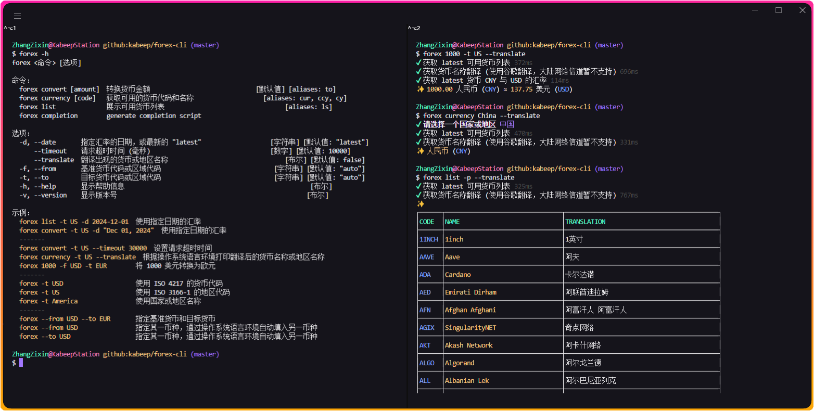

<div align="center">

<h1>forex-cli</h1>

[![NodeJS][node-image]][node-url]
[![Install Size][install-size-image]][install-size-url]
[![NPM][npm-image]][npm-url]
[![code style][code-style-image]][code-style-url]
[![License][license-image]][license-url]

[English][en-us-url] | 简体中文

![Insights][insights-image]



</div>

## 📖 简介

用于在终端中转换外汇的 Node.js 库。

## ⚙️ 安装

```bash
npm install --global @kabeep/forex-cli
```

```bash
yarn add --global @kabeep/forex-cli
```

```bash
pnpm add --global @kabeep/forex-cli
```

## 🚀 使用

```
forex [选项] <金额>

选项：
  -f, --from     基准货币代码或区域代码                                 [字符串] [默认值: "auto"]
  -t, --to       基准货币代码或区域代码                                 [字符串] [默认值: "auto"]
  -d, --date     指定汇率的日期，或最新的 "latest"                     [字符串] [默认值: "latest"]
      --timeout  请求超时时间 (毫秒)                                    [数字] [默认值: 5000]
  -v, --version  显示版本号                                                      [布尔]
  -h, --help     显示帮助信息                                                     [布尔]

示例：
  forex -t USD                   使用 ISO 4217 的货币代码
  forex -t US                    使用 ISO 3166-1 的区域代码
  -------
  forex -f USD -t EUR            指定基准货币和目标货币
  forex -f USD                   指定其一币种，通过终端区域设置自动填入另一币种
  forex -t USD                   指定其一币种，通过终端区域设置自动填入另一币种
  -------
  forex -t US -d 2024-12-01      使用指定日期的汇率
  forex -t US -d "Dec 01, 2024"  使用指定日期的汇率
  -------
  forex -t US --timeout 30000    设置请求超时时间
```

## 🌐 国际化

| 语言名称                |     本地名称      | ISO-639-1 | ISO-3166-1 (Alpha-2) | 文件                           |
|:--------------------|:-------------:|:---------:|:--------------------:|:-----------------------------|
| English             |       -       |    en     |          US          | [en-US.ts][locale-en-us-url] |
| Chinese Simplified  |     简体中文      |    zh     |          CN          | [zh-CN.ts][locale-zh-cn-url] |

## 🔗 关联库

- [forex][forex-url] - 💱 一个 JavaScript 外汇库，使用 `fawazahmed0` 的 API。

## 🤝 贡献

欢迎通过 Pull Requests 或 [Issues][issues-url] 来贡献你的想法和代码。

## 📄 许可

本项目采用 MIT 许可证。详情请见 [LICENSE][license-url] 文件。


[insights-image]: https://repobeats.axiom.co/api/embed/a0e4d0ae3edced5fd9a045527c7eef9aecfb6c0d.svg "Repobeats analytics image"

[node-image]: https://img.shields.io/node/v/%40kabeep%2Fforex-cli?color=lightseagreen
[node-url]: https://nodejs.org/

[npm-image]: https://img.shields.io/npm/d18m/%40kabeep%2Fforex-cli?color=fa6673
[npm-url]: https://www.npmjs.com/package/@kabeep/forex-cli

[install-size-image]: https://packagephobia.com/badge?p=@kabeep/forex-cli
[install-size-url]: https://packagephobia.com/result?p=@kabeep/forex-cli

[code-style-image]: https://img.shields.io/badge/Formatted_with-Biome-cornflowerblue?style=flat&logo=biome
[code-style-url]: https://biomejs.dev/

[license-image]: https://img.shields.io/github/license/kabeep/forex-cli?color=slateblue
[license-url]: LICENSE

[en-us-url]: README.md
[zh-cn-url]: README.zh-CN.md

[locale-en-us-url]: src/locale/en-US.ts
[locale-zh-cn-url]: src/locale/zh-CN.ts

[forex-url]: https://github.com/kabeep/forex

[issues-url]: https://github.com/kabeep/forex-cli/issues
