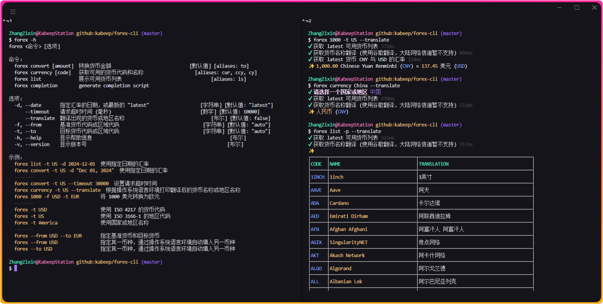

<div align="center">

<h1>forex-cli</h1>

[![NodeJS][node-image]][node-url]
[![Install Size][install-size-image]][install-size-url]
[![NPM][npm-image]][npm-url]
[![code style][code-style-image]][code-style-url]
[![License][license-image]][license-url]

[English][en-us-url] | 简体中文

![Insights][insights-image]



</div>

## 📖 简介

用于在终端中转换外汇的 Node.js 库。

## ⚙️ 安装

```bash
npm install --global @kabeep/forex-cli
```

```bash
yarn add --global @kabeep/forex-cli
```

```bash
pnpm add --global @kabeep/forex-cli
```

## 🚀 使用

```bash
forex -h
```

或者使用简写。

```bash
fx -h
```

```
forex <命令> [选项]

命令：
  forex convert [amount]  转换货币金额                                    [aliases: to]
  forex currency [code]   获取可用的货币代码和名称                   iases: cur, ccy, cy]
  forex list              展示可用货币列表                                 [aliases: ls]
  forex completion        生成自动完成脚本

选项：
  -d, --date       指定汇率的日期，或最新的 "latest"             [字符串] [默认值: "latest"]
      --timeout    请求超时时间 (毫秒)                              [数字] [默认值: 10000]
  -c, --clipboard  写入 (复制) 结果到剪贴板                          [布尔] [默认值: false]
  -T, --translate  翻译出现的货币或地区名称                           [布尔] [默认值: false]
  -V, --verbose    输出程序内部执行的详细步骤信息                      [布尔] [默认值: false]
  -f, --from       基准货币代码或区域代码                          [字符串] [默认值: "auto"]
  -t, --to         目标货币代码或区域代码                          [字符串] [默认值: "auto"]
  -v, --version    显示版本号                                                     [布尔]
  -h, --help       显示帮助信息                                                   [布尔]

示例：
  forex list -t US -d 2024-12-01  使用指定日期的汇率
  forex convert -t US -d "Dec 01, 2024"  使用指定日期的汇率
  -------
  forex convert -t US --timeout 30000  设置请求超时时间
  forex currency -t US --translate  根据操作系统语言环境打印翻译后的货币名称或地区名称
  forex 1000 -f USD -t EUR        将 1000 美元转换为欧元
  -------
  forex -t USD                    使用 ISO 4217 的货币代码
  forex -t US                     使用 ISO 3166-1 的地区代码
  forex -t America                使用国家或地区名称
  -------
  forex --from USD --to EUR       指定基准货币和目标货币
  forex --from USD                指定其一币种，通过操作系统语言环境自动填入另一币种
  forex --to USD                  指定其一币种，通过操作系统语言环境自动填入另一币种
```

### 快速开始

将 1000 美元转换为你的货币 （根据操作系统语言环境获取）。

```bash
forex 1000 --from US
```

```
✔ 获取 latest 可用货币列表 369ms
✔ 获取 latest 货币 USD 与 CNY 的汇率 119ms
✨ 1,000.00 美元 (USD) ≈ 7,259.48 人民币 (CNY)
```

## 🔩 命令

| 命令           | 别名                   | 默认    | 参数                       | 描述           |
|--------------|----------------------|-------|--------------------------|--------------|
| `convert`    | `to`                 | true  | 金额                       | 转换货币金额       |
| `currency`   | `cur` / `ccy` / `cy` | false | 货币代码 / 国家或地区代码 / 国家或地区名称 | 获取可用的货币代码和名称 |
| `list`       | `ls`                 | false | -                        | 展示可用货币列表     |
| `completion` | -                    | false | -                        | 生成自动完成脚本     |

**通用选项:**

```bash
forex list --date "Dec 01, 2024" --timeout 10000 --translate --verbose --clipboard
```

或者使用简写。

```bash
fx list -d "Dec 01, 2024" --timeout 10000 -TVc
```

| 选项                   | 类型        | 可选   | 默认值        | 描述                    |
|----------------------|-----------|------|------------|-----------------------|
| `--date` / `-d`      | `string`  | true | `"latest"` | 指定汇率的日期，或最新的 "latest" |
| `--timeout`          | `number`  | true | `10_000`   | 请求超时时间 (毫秒)           |
| `--clipboard` / `-c` | `boolean` | true | `false`    | 写入 (复制) 结果到剪贴板        |
| `--translate` / `-T` | `boolean` | true | `false`    | 翻译出现的货币或地区名称          |
| `--verbose` / `-V`   | `boolean` | true | `false`    | 输出程序内部执行的详细步骤信息       |
| `--version` / `-v`   | `boolean` | true | `false`    | 显示版本号                 |
| `--help` / `-h`      | `boolean` | true | `false`    | 显示帮助信息                |

### $ CONVERT (默认)

转换货币金额。

支持的 `金额` 格式:

- 基本的 `10000`
- 数字分隔符 `10_000`
- 科学计数法 `1.23e3`
- 统计格式化 `10,000`
- 财务简写 `1.1b1m1k1.01` * b(illion) / m(illion) / k=(Thousand)

```bash
forex convert -h
```

```
forex convert [amount]

转换货币金额

选项：
  -d, --date       指定汇率的日期，或最新的 "latest"                   [字符串] [默认值: "latest"]
      --timeout    请求超时时间 (毫秒)                                    [数字] [默认值: 10000]
  -c, --clipboard  写入 (复制) 结果到剪贴板                                [布尔] [默认值: false]
  -T, --translate  翻译出现的货币或地区名称                                 [布尔] [默认值: false]
  -V, --verbose    输出程序内部执行的详细步骤信息                            [布尔] [默认值: false]
  -f, --from       基准货币代码或区域代码                                [字符串] [默认值: "auto"]
  -t, --to         目标货币代码或区域代码                                [字符串] [默认值: "auto"]
  -v, --version    显示版本号                                                           [布尔]
  -h, --help       显示帮助信息                                                         [布尔]

示例：
  forex 1000 -f USD -t EUR   将 1000 美元转换为欧元
  -------
  forex -t USD               使用 ISO 4217 的货币代码
  forex -t US                使用 ISO 3166-1 的地区代码
  forex -t America           使用国家或地区名称
  -------
  forex --from USD --to EUR  指定基准货币和目标货币
  forex --from USD           指定其一币种，通过操作系统语言环境自动填入另一币种
  forex --to USD             指定其一币种，通过操作系统语言环境自动填入另一币种
```

| 选项              | 类型       | 可选   | 默认值      | 描述          |
|-----------------|----------|------|----------|-------------|
| `--from` / `-f` | `string` | true | `"auto"` | 基准货币代码或区域代码 |
| `--to` / `-t`   | `string` | true | `"auto"` | 目标货币代码或区域代码 |

- 将 1000 美元转换为欧元。

  ```bash
  forex convert 1000 --from USD --to EUR
  ```

  ```
  ✔ 获取 latest 可用货币列表 369ms
  ✔ 获取 latest 货币 USD 与 EUR 的汇率 119ms
  ✨ 1,000.00 美元 (USD) ≈ 951.83 欧元 (EUR)
  ```

- 将你的 1000 数量货币转换为美元 （根据操作系统语言环境获取）。

  ```bash
  forex convert 1000 --to USD
  ```

  ```
  ✔ 获取 latest 可用货币列表 369ms
  ✔ 获取 latest 货币 CNY 与 美元 的汇率 119ms
  ✨ 1,000.00 人民币 (CNY) ≈ 137.75 美元 (USD)
  ```

- 将 1000 美元转换为你的货币 （根据操作系统语言环境获取）。

  ```bash
  forex convert 1000 --from USD
  ```

  ```
  ✔ 获取 latest 可用货币列表 369ms
  ✔ 获取 latest 货币 USD 与 CNY 的汇率 119ms
  ✨ 1,000.00 美元 (USD) ≈ 7,259.48 人民币 (CNY)
  ```

---

### $ CURRENCY

获取可用的货币代码和名称。

```bash
forex currency -h
```

```
forex currency [code]

获取可用的货币代码和名称

选项：
  -d, --date       指定汇率的日期，或最新的 "latest"                    [字符串] [默认值: "latest"]
      --timeout    请求超时时间 (毫秒)                                     [数字] [默认值: 10000]
  -c, --clipboard  写入 (复制) 结果到剪贴板                                 [布尔] [默认值: false]
  -T, --translate  翻译出现的货币或地区名称                                  [布尔] [默认值: false]
  -V, --verbose    输出程序内部执行的详细步骤信息                             [布尔] [默认值: false]
  -v, --version    显示版本号                                                           [布尔]
  -h, --help       显示帮助信息                                                          [布尔]

示例：
  forex cy US       通过 ISO-3166-1-alpha-2 地区代码获取
  forex cy USD      通过 ISO 4217 货币代码获取
  forex cy America  通过国家或地区名称获取
```

- 通过 `ISO-3166-1-alpha-2` 地区代码获取。

  ```bash
  forex currency CN
  ```

  ```
  ✔ 获取 latest 可用货币列表 369ms
  ✨ 人民币 (CNY)
  ```

- 通过 `ISO 4217` 货币代码获取。

  ```bash
  forex currency CNY
  ```

  ```
  ✔ 获取 latest 可用货币列表 369ms
  ✨ 人民币 (CNY)
  ```

- 通过国家或地区名称获取。

  ```bash
  forex currency China
  ```

  ```
  ✔ 获取 latest 可用货币列表 369ms
  ✨ 人民币 (CNY)
  ```

---

### $ LIST

展示可用货币列表。

```bash
forex list -h
```

```
forex list

展示可用货币列表

选项：
  -d, --date       指定汇率的日期，或最新的 "latest"                    [字符串] [默认值: "latest"]
      --timeout    请求超时时间 (毫秒)                                     [数字] [默认值: 10000]
  -c, --clipboard  写入 (复制) 结果到剪贴板                                 [布尔] [默认值: false]
  -T, --translate  翻译出现的货币或地区名称                                  [布尔] [默认值: false]
  -V, --verbose    输出程序内部执行的详细步骤信息                             [布尔] [默认值: false]
  -p, --pretty     美化输出格式                                           [布尔] [默认值: false]
  -v, --version    显示版本号                                                           [布尔]
  -h, --help       显示帮助信息                                                          [布尔]

示例：
  forex ls     展示最新的可用货币列表
  forex ls -p  使用 unicode 表格美化打印内容
```

| 选项                | 类型        | 可选   | 默认值     | 描述     |
|-------------------|-----------|------|---------|--------|
| `--pretty` / `-p` | `boolean` | true | `false` | 美化输出格式 |

- 展示最新的可用货币列表。

  ```bash
  forex list
  ```

  ```
  Australian Dollar / 澳元 (AUD)
  Canadian Dollar / 加拿大元 (CAD)
  Euro / 欧元 (EUR)
  Japanese Yen / 日元 (JPY)
  Hong Kong Dollar / 港币 (HKD)
  South Korean Won / 韩元 (KRW)
  Singapore Dollar / 新加坡元 (SGD)
  Thai Baht / 泰铢 (THB)
  Taiwan New Dollar / 新台币 (TWD)
  US Dollar / 美元 (USD)
  ...
  ```

- 使用 unicode 表格美化打印内容。

  ```bash
  forex list --pretty
  ```

  ```
  ┌──────┬────────────────────────────────┬──────────────────────────────────────────┐
  │CODE  │NAME                            │TRANSLATION                               │
  ├──────┼────────────────────────────────┼──────────────────────────────────────────┤
  │AUD   │Australian Dollar               │澳元                                      │
  ├──────┼────────────────────────────────┼──────────────────────────────────────────┤
  │CAD   │Canadian Dollar                 │加拿大元                                   │
  ├──────┼────────────────────────────────┼──────────────────────────────────────────┤
  │EUR   │Euro                            │欧元                                      │
  ├──────┼────────────────────────────────┼──────────────────────────────────────────┤
  │JPY   │Japanese Yen                    │日元                                      │
  ├──────┼────────────────────────────────┼──────────────────────────────────────────┤
  │HKD   │Hong Kong Dollar                │港币                                      │
  ├──────┼────────────────────────────────┼──────────────────────────────────────────┤
  │TWD   │Taiwan New Dollar               │新台币                                     │
  ├──────┼────────────────────────────────┼──────────────────────────────────────────┤
  │KRW   │South Korean Won                │韩元                                      │
  ├──────┼────────────────────────────────┼──────────────────────────────────────────┤
  │SGD   │Singapore Dollar                │新加坡元                                   │
  ├──────┼────────────────────────────────┼──────────────────────────────────────────┤
  │THB   │Thai Baht                       │泰铢                                      │
  ├──────┼────────────────────────────────┼──────────────────────────────────────────┤
  │USD   │US Dollar                       │美元                                      │
  ├──────┼────────────────────────────────┼──────────────────────────────────────────┤
  │...   │...                             │...                                       │
  └──────┴────────────────────────────────┴──────────────────────────────────────────┘
  ```

---

### $ COMPLETION

生成自动完成（补全）脚本。

```bash
forex completion -h
```

```
###-begin-forex-completions-###
#
# yargs command completion script
#
# Installation: forex completion >> ~/.bashrc
#    or forex completion >> ~/.bash_profile on OSX.
#
_forex_yargs_completions()
{
    local cur_word args type_list

    cur_word="${COMP_WORDS[COMP_CWORD]}"
    args=("${COMP_WORDS[@]}")

    # ask yargs to generate completions.
    type_list=$(forex --get-yargs-completions "${args[@]}")

    COMPREPLY=( $(compgen -W "${type_list}" -- ${cur_word}) )

    # if no match was found, fall back to filename completion
    if [ ${#COMPREPLY[@]} -eq 0 ]; then
      COMPREPLY=()
    fi

    return 0
}
complete -o bashdefault -o default -F _forex_yargs_completions forex
###-end-forex-completions-###
```

---

### $ HELP

显示帮助信息。

```bash
forex help
```

- 显示 `convert` 命令帮助信息。

  ```bash
  forex convert help
  ```

- 显示 `currency` 命令帮助信息。

  ```bash
  forex currency help
  ```

- 显示 `list` 命令帮助信息。

  ```bash
  forex list help
  ```

## 🌐 国际化

| 语言名称                |     本地名称      | ISO-639-1 | ISO-3166-1 (Alpha-2) | 文件                           |
|:--------------------|:-------------:|:---------:|:--------------------:|:-----------------------------|
| English             |       -       |    en     |          US          | [en-US.ts][locale-en-us-url] |
| Chinese Simplified  |     简体中文      |    zh     |          CN          | [zh-CN.ts][locale-zh-cn-url] |

## 🔗 关联库

- [forex][forex-url] - 💱 一个 JavaScript 外汇库，使用 `fawazahmed0` 的 API。

## 🤝 贡献

欢迎通过 Pull Requests 或 [Issues][issues-url] 来贡献你的想法和代码。

## 📄 许可

本项目采用 MIT 许可证。详情请见 [LICENSE][license-url] 文件。


[insights-image]: https://repobeats.axiom.co/api/embed/a0e4d0ae3edced5fd9a045527c7eef9aecfb6c0d.svg "Repobeats analytics image"

[node-image]: https://img.shields.io/node/v/%40kabeep%2Fforex-cli?color=lightseagreen
[node-url]: https://nodejs.org/

[npm-image]: https://img.shields.io/npm/d18m/%40kabeep%2Fforex-cli?color=fa6673
[npm-url]: https://www.npmjs.com/package/@kabeep/forex-cli

[install-size-image]: https://packagephobia.com/badge?p=@kabeep/forex-cli
[install-size-url]: https://packagephobia.com/result?p=@kabeep/forex-cli

[code-style-image]: https://img.shields.io/badge/Formatted_with-Biome-cornflowerblue?style=flat&logo=biome
[code-style-url]: https://biomejs.dev/

[license-image]: https://img.shields.io/github/license/kabeep/forex-cli?color=slateblue
[license-url]: LICENSE

[en-us-url]: README.md
[zh-cn-url]: README.zh-CN.md

[locale-en-us-url]: src/locale/en-US.ts
[locale-zh-cn-url]: src/locale/zh-CN.ts

[forex-url]: https://github.com/kabeep/forex

[issues-url]: https://github.com/kabeep/forex-cli/issues
